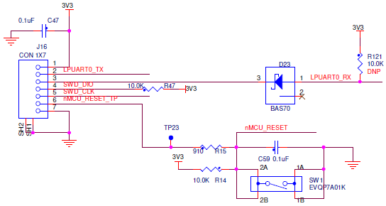

# Debug interface (DCD-LZ)

**DCD** stands for _Dronecode Debug_, and the letters **LZ** stands for the NXP design partner _Landzo_ and uniquely differentiate it from DCD-M and DCD-S. The DCD-LZ interface used on RDDRONE-FMUK66 is similar to the normal Dronecode debug interface (DCD-M or DCD-S), but with the following changes:

* It is 7 pin instead of 6 pin, the RST line for the MCU is added.
* It uses the same JST-GH connector as the other interfaces instead of the smaller JST-SH or JST-SUR.

Details on the original interfaces can be found here:

* [https://wiki.dronecode.org/workgroup/connectors/start#dronecode\_debug](https://wiki.dronecode.org/workgroup/connectors/start#dronecode\_debug)
* [https://kb.zubax.com/display/MAINKB/Dronecode+Probe+documentation](https://github.com/nxphlite-team/prototype-nxphlite/tree/62a62a814277e53f66ad3d46761880fe29ce682f/h%20ttps:/kb.zubax.com/display/MAINKB/Dronecode+Probe+documentation/README.md)

## Connector pinout

| Pin | Signal    | Voltage |
| --- | --------- | ------- |
| 1   | VCC       | +3.3V   |
| 2   | UART TX   | +3.3V   |
| 3   | UART RX   | +3.3V   |
| 4   | SWD DIO   | +3.3V   |
| 5   | SWD CLK   | +3.3V   |
| 6   | MCU RESET | +3.3V   |
| 7   | GND       | GND     |

## RDDRONE-FMUK66 Rev. C schematic

## RDDRONE-FMUK66 Rev. B schematic


Rev. B (and older boards) are **not supported** anymore. This information is left for reference.


## Exposed interfaces

### ARM SWD debug interface

One of the two interfaces on the DCD-LZ connector is the ARM SWD interface. SWD stands for Serial Wire Debug and is an ARM processor alternative to the JTAG interface. It is what is used to program the board "from scratch" even when there is nothing in the microcontroller memory. This is in contrast to the USB bootloader, which relies on the fact that valid PX4 software is already running.

Note - While the RDRONE-FMUK66 uses NuttX RTOS and the PX4 flight stack by default, any other RTOS and flight stack could be loaded. In fact ANY software compiled for the NXP Kinetis K66 MCU could be loaded including ARM MBED, FreeRTOS, MQX RTOS, or BareMetal code using MCUXpresso and KSDK (Software Development Kit peripheral libraries).

### UART / system console

The UART is typically used to access the _primary serial console_ of the target which can be helpful while debugging. Note that this should not be confused with the fact that **when PX4 is running** a second and third instance of the serial console that are available via the USB interface and telemetry UARTs on board. (Technically the console can be routed to multiple locations). The difference with the primary serial console is that it will show the NuttX bootup sequence of the board and can be used to identify lower level issues before PX4 is even running.

## &#x20;
